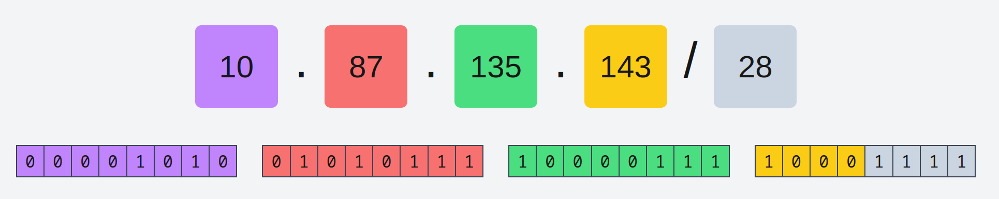

# cidr.xyz

**Web-based CIDR / netmask / IP address visualizer - https://cidr.xyz**

[](https://cidr.xyz)

## Dev

Install dependencies and run the development server:

```bash
$ yarn
$ yarn run start
```

## Build

Manually building the static content into the `dist/` directory can be done with:

```bash
$ yarn run build
```

## Deployment

Deployment is automated from `master` branch via Netlify
